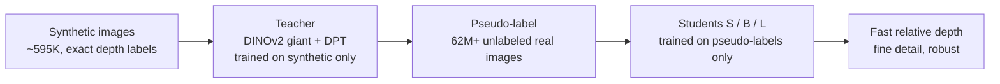
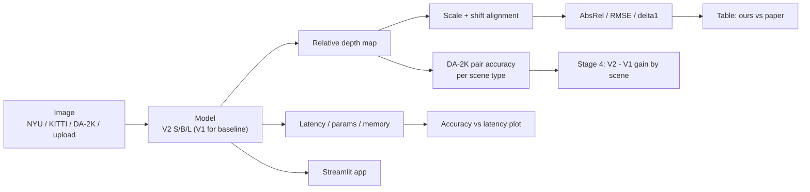

# Design

GitHub renders the diagrams below natively (Mermaid).

## 1. The paper's method

## 2. Our pipeline

## 3. Design rationale
- **One `predict()` for everything.** Eval scripts, latency benchmark and the app all call `DepthModel.predict`, so preprocessing cannot drift between what we evaluate and what we deploy (the brief's main deployment pitfall).
- **HF `transformers` port, not the raw repo.** Same weights, one pip install, identical in Colab and the app. The official repo remains our reference for the protocol.
- **Pure-numpy metrics with unit tests.** Metric bugs are the cheapest way to get a wrong table; tests run in a second with no GPU.
- **Long-format results CSVs.** Every script writes `(model, dataset, metric, ours)`, so the paper-vs-ours table is a single merge.
- **Protocol frozen first** (`docs/EVAL_PROTOCOL.md`), before any full run.

## 4. Workflow
- **Compute:** Colab/Kaggle T4 for scripts 02-04 (`notebooks/colab_runner.ipynb`); laptops/CPU for the app, tests, docs. Colab disk is wiped: commit `results/` and `figures/` after each run.
- **Split (suggestion, adjust):**
  - Person A - data: NYU/DA-2K/KITTI loaders, `EVAL_PROTOCOL.md`, hard-case checks.
  - Person B - models + metrics: `models.py`, `metrics.py`, tests, scripts 02-03, paper-vs-ours table.
  - Person C - deployment + experiment: Streamlit app, script 04-06, `EXPERIMENT.md`.
  - Everyone: PROVENANCE rows for their own files; each can explain the whole paper (Stage 2 self-test).
- **Git:** `main` always runs. One branch per task (`feat/metrics`, `feat/app`), pull request, one teammate reviews.
- **How this supports Stage 4 and deployment:** scripts 03 and 05 are the experiment; script 04 gives the latency axis; the app reuses `predict()` and the S/B/L selector.
